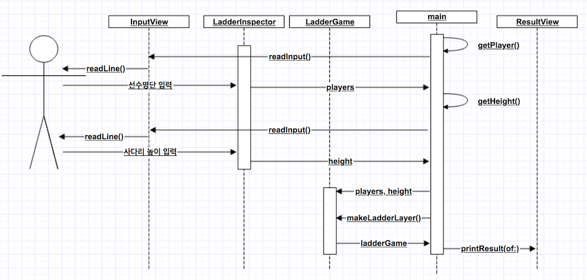

# 사다리게임

## step1 (시작하기)
### 요구사항
- 간단한 사다리 게임을 구현한다.
- n개의 사람과 m개의 사다리 개수를 입력할 수 있어야 한다.
- 사다리는 랜덤으로 있거나 없을 수도 있다.
- 사다리가 있으면 -를 표시하고 없으면 " " 빈공백을 표시한다. 양옆에는 |로 세로를 표시한다.
- 사다리 상태를 화면에 출력한다. 어느 시점에 출력할 것인지에 대한 제약은 없다.
- struct 작성하지 않고 함수만으로 구현해본다.

### 프로그래밍 요구사항
- 메소드가 너무 많은 일을 하지 않도록 분리하기 위해 노력해 본다.

---
## step2 (함수 역할 분리)
### 요구사항
- 기존 코드를 모두 삭제하고 처음부터 다시 구현을 시작하거나, 이전 단계 사다리게임 요구사항을 구현한 상태에서 시작한다.
- 사다리가 옆으로 연속해서 |-|-| 나오지 않도록 검증한다.
- indent(인덴트, 들여쓰기) depth를 2단계에서 1단계로 줄여라.
- depth의 경우 if문을 사용하는 경우 1단계의 depth가 증가한다. if문 안에 while문을 사용한다면 depth가 2단계가 된다.
- else를 사용하지 마라.
- 메소드의 크기가 최대 10라인을 넘지 않도록 구현한다.
- method가 한 가지 일만 하도록 최대한 작게 만들어라.

---
## step3 (객체 역할 분담)
- 기존 코드를 모두 삭제하고 처음부터 다시 구현을 시작하거나, 이전 단계 메소드 분리 요구사항을 구현한 상태에서 시작한다.
- 구조체 타입 강의 슬라이드 자료를 학습한다.
- 사다리 게임에 참여하는 사람에 이름을 최대5글자까지 부여할 수 있다. 사다리를 출력할 때 사람 이름도 같이 출력한다.
- 사람 이름은 쉼표(,)를 기준으로 구분한다.
- 사람 이름을 5자 기준으로 출력하기 때문에 사다리 폭도 넓어져야 한다.

---
## step4 (단위 테스트)
- 단위 테스트를 위해 UnitTest 번들을 추가한다.
- 단위테스트 타깃 이름을 지정해준다.
- 테스트 코드를 추가한다.

---
## Sequence Diagram


---
## 중간에 고생했던 부분 / 기억할 부분 간단 정리
- arc4random_uniform()를 이용하여 랜덤값 다룰 수 있음
- split(separator: ",")를 이용하면 문자열에서 쉼표(,)를 기준으로 분리가 가능하다
- 애플 테스트 가이드 문서
- JavaScript의 some과 every Swift로 구현하기
```
// check if EVERY playerNames are validate
!playerNames.contains(where: { return !validate(playerName: $0) })

// check if SOME playerNames are not validate
playerNames.contains(where: { return !validate(playerName: $0) })
```
